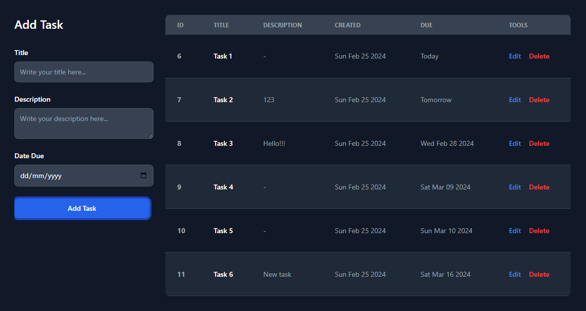

# electron-react-sqlite

An Electron to-do list app using SQLite3 + React



## Build Requirements ( Windows )
- Python >= 3.7
- Visual Studio 2019 (>=16.0.0) with Windows SDK 10/11

For Mac OS and Linux check [Electron docs](https://www.electronjs.org/docs/latest/development/build-instructions-gn)

## Recommended IDE Setup

- [VSCode](https://code.visualstudio.com/) + [ESLint](https://marketplace.visualstudio.com/items?itemName=dbaeumer.vscode-eslint) + [Prettier](https://marketplace.visualstudio.com/items?itemName=esbenp.prettier-vscode)

## Project Setup

### Install

```bash
$ yarn
```

### Development

```bash
$ yarn dev
```

### Build

```bash
# For windows
$ yarn build:win

# For macOS
$ yarn build:mac

# For Linux
$ yarn build:linux
```
